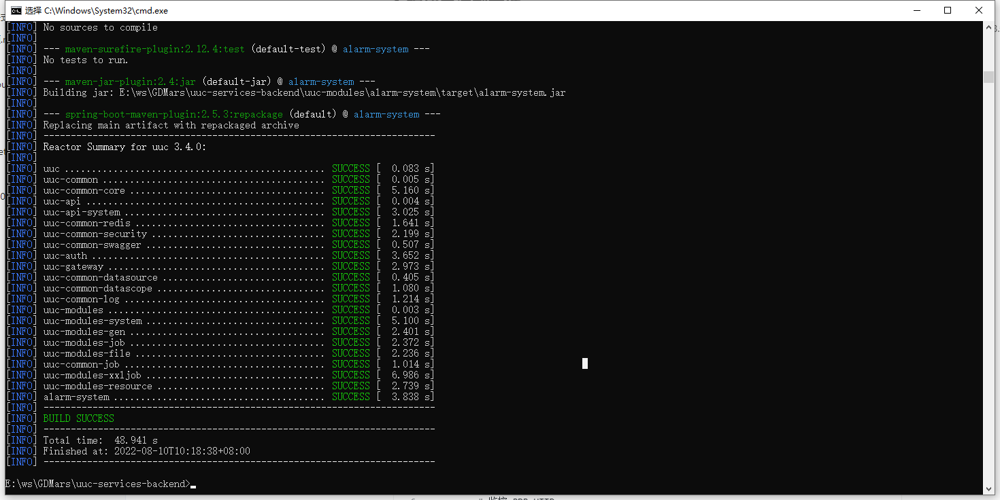

## 1、构建二进制文件

```shell
cd uuc-service-backend
mvn clean package
```



## 2、修改nacos配置

### 2.1、gdmars-gateway-dev

- routes：增加监控MONITOR ALARM HTTP

```yaml
spring:
  cloud:
    gateway:
      routes:
        # ...
        # 监控 MONITOR ALARM HTTP
        - id: MONITOR-ALARM-HTTP
          uri: lb://alarm-system
          predicates:
            - Path=/monitor/alarm/**
          filters:
            - StripPrefix=2
        # ...
```

### 2.2、Nacos的uuc命名空间下增加alarm-system-dev配置

- spring.redis：host、port、password
- spring.datasource.dynamic.datasource：
  - master：url(ip、port)、username、password
  - slave：url(ip、port)、username、password
- prometheus：url

```yaml
# spring配置
spring: 
  redis:
    host: 10.128.40.206
    port: 6379
    password: Q1^dzq5H4H
  mvc:
    pathmatch:
      matching-strategy: ant_path_matcher
  datasource:
    druid:
      stat-view-servlet:
        enabled: true
        loginUsername: admin
        loginPassword: 123456
    dynamic:
      druid:
        initial-size: 5
        min-idle: 5
        maxActive: 20
        maxWait: 60000
        timeBetweenEvictionRunsMillis: 60000
        minEvictableIdleTimeMillis: 300000
        validationQuery: SELECT 1 FROM DUAL
        testWhileIdle: true
        testOnBorrow: false
        testOnReturn: false
        poolPreparedStatements: true
        maxPoolPreparedStatementPerConnectionSize: 20
        filters: stat,slf4j
        connectionProperties: druid.stat.mergeSql\=true;druid.stat.slowSqlMillis\=5000
      datasource:
        # 主库数据源
        master:
          driver-class-name: com.mysql.cj.jdbc.Driver
          url: jdbc:mysql://10.128.40.205:3306/monitor_mon?useUnicode=true&characterEncoding=utf8&zeroDateTimeBehavior=convertToNull&useSSL=true&serverTimezone=GMT%2B8
          username: root
          password: Public-service#123
        # 从库数据源
        slave:
          driver-class-name: com.mysql.cj.jdbc.Driver
          url: jdbc:mysql://10.128.40.205:3306/monitor_rdb?useUnicode=true&characterEncoding=utf8&zeroDateTimeBehavior=convertToNull&useSSL=true&serverTimezone=GMT%2B8
          username: root
          password: Public-service#123
  # seata: true    # 开启seata代理，开启后默认每个数据源都代理，如果某个不需要代理可单独关闭
  rabbitmq:
    host: 10.128.40.209
    port: 5672
    username: admin
    password: Rabbitmq#123
    listener:
      simple:
        retry:
          enabled: true
          max-attempts: 5
          max-interval: 20000ms
          initial-interval: 3000ms
          multiplier: 2
        default-requeue-rejected: true

# seata配置
seata:
  # 默认关闭，如需启用spring.datasource.dynami.seata需要同时开启
  enabled: false
  # Seata 应用编号，默认为 ${spring.application.name}
  application-id: ${spring.application.name}
  # Seata 事务组编号，用于 TC 集群名
  tx-service-group: ${spring.application.name}-group
  # 关闭自动代理
  enable-auto-data-source-proxy: false
  # 服务配置项
  service:
    # 虚拟组和分组的映射
    vgroup-mapping:
      uuc-system-group: default
  config:
    type: nacos
    nacos:
      serverAddr: 10.128.40.208:8848
      group: SEATA_GROUP
      namespace:
  registry:
    type: nacos
    nacos:
      application: seata-server
      server-addr: 10.128.40.208:8848
      namespace:

# mybatis配置
mybatis:
  # 搜索指定包别名
  typeAliasesPackage: com.uuc.alarm
  # 配置mapper的扫描，找到所有的mapper.xml映射文件
  mapperLocations: classpath:mapper/**/*.xml

# swagger配置
swagger:
  title: 系统模块接口文档
  basePackage: com.uuc.alarm
dingtalk:
  appKey: dingka5voydzynfocyp2
  appSecret: GL68Fhn70oo2XiVxYO-CWeXH10thpMa9w79cY6kj1BLvvTUZIxZ3iMKywuKD3Z7b

upload:
  type: base64
base64:
  id: 1
  name: xxx
redis:
  stream:
    enabled: true
    streamName: test
    consumerGroup: testGroup
    consumerName: xjy
    fieldName: syncBody
rabbitmq:
  config:
    exchangeName: direct_ump_cmdb_sync_exchange
    routingKey: topic.toCmdb.queue
    queueName: uucToCmdb.queue
prometheus:
  url: http://10.128.120.26:8082/select/0/prometheus 
```

## 3.修改配置文件

### 3.1、bootstrap-dev

- spring.cloud.nacos.discovery：server-add、username、password、namespace
- spring.cloud.nacos.config：server-add、username、password、namespace

```yaml
# Spring
spring:
  cloud:
    nacos:
      discovery:
        # 服务注册地址
        server-addr: ${NACOS_ADDR:10.128.40.208:8848}
        username: ${NACOS_USERNAME:nacos}
        password: ${NACOS_PASSWORD:Nacos#123}
        namespace: ${NACOS_NAMESPACE:uuc}
      config:
        # 配置中心地址
        server-addr: ${NACOS_ADDR:10.128.40.208:8848}
        # 配置文件格式
        file-extension: yml
        # 命名空间
        username: ${NACOS_USERNAME:nacos}
        password: ${NACOS_PASSWORD:Nacos#123}
        namespace: ${NACOS_NAMESPACE:uuc}
        # 配置组
        group: UNIFIED_MANAGEMENT
        # 共享配置
        shared-configs:
          - application-${spring.profiles.active}.${spring.cloud.nacos.config.file-extension}
        # 扩展配置
#        extension-configs[0]:
#          dataId: keycloak.properties
#          group: UNIFIED_MANAGEMENT
#          refresh: true

```

## 4、启停脚本

```shell
#!/bin/bash

source /etc/profile
ServiceName=alarm-system

#### 启动脚本
start() {
  CMD_PATH="/data/service/${ServiceName}"
  cd $CMD_PATH/ || exit
  java -jar -Xms512m -Xmx1024m -Xmn64m -Xss256k -XX:SurvivorRatio=8 -XX:+UseConcMarkSweepGC ${ServiceName}.jar --server.port=9515 --spring.profiles.active=dev --spring.cloud.bootstrap.location=./config/ >>./logs/console.log 2>&1 &
  echo $! >$CMD_PATH/${ServiceName}.pid
}

#### 停止脚本
stop() {
  CMD_PATH="/data/service/${ServiceName}"
  PID=$(cat $CMD_PATH/${ServiceName}.pid)
  kill -9 "$PID"
}

#### 查看日志
showlog() {
  CMD_PATH="/data/service/${ServiceName}"
  cd $CMD_PATH/ || exit
  tail -fn 300 $CMD_PATH/logs/console.log
  echo $! >$CMD_PATH/${ServiceName}.pid
}

case $1 in
showlog)
  showlog
  ;;
start)
  start
  ;;
stop)
  stop
  ;;
restart)
  stop
  start
  ;;
esac

```

```shell
# 启动
service.sh start
# 停止
service.sh stop
# 重启
service.sh restart
# 查看日志
service.sh showlog
```

## 5、备份旧的文件[首次部署不需要这一步]

> 目录: 请根据之前的部署说明文档确认目录（`/data/service/alarm-system`）

1、新建备份目录

```shell
mkdir -p /data/service/alarm-system/backup-$(date '+%Y%m%d')
cd /data/service/alarm-system/backup-$(date '+%Y%m%d')
```

2、复制旧文件到备份目录

```
alarm-system.jar
config
  bootstrap-dev.yml
  bootstrap.yml
service.sh
```

### 6.部署

1、创建`update-$(date '+%Y%m%d')`目录
```shell
mkdir -p /data/service/alarm-system/update-$(date '+%Y%m%d') 
cd /data/service/alarm-system/update-$(date '+%Y%m%d')
```

2、传输文件到`update-$(date '+%Y%m%d')`
```
#生成的jar在uuc-services-backend/uuc-modules/alarm-system/target目录下面
alarm-system.jar
config
  bootstrap-dev.yml
  bootstrap.yml
service.sh
```

3、切换目录
```shell
cd /data/service/alarm-system
```

4、停止旧的服务 [首次部署不需要这一步]
```shell
./service.sh stop
```

5、从`update-$(date '+%Y%m%d')`中将新的文件复制到`/data/service/alarm-system`中
```
alarm-system.jar
config
  bootstrap-dev.yml
  bootstrap.yml
service.sh
```

6、shell脚本添加可执行权限
```shell
chmod +x service.sh
```

7、创建logs目录

```shell
mkdir -p logs
```

8、启动服务

```shell
./service.sh start
```

9、验收

- 查看进程
  - `ps -ef | grep alarm-system`
- 日志目录 `/data/service/logs/服务名/alarm-system.log`
- 成功启动的关键日志：`hStarting ProtocolHandler ["http-nio-${port}"]`
